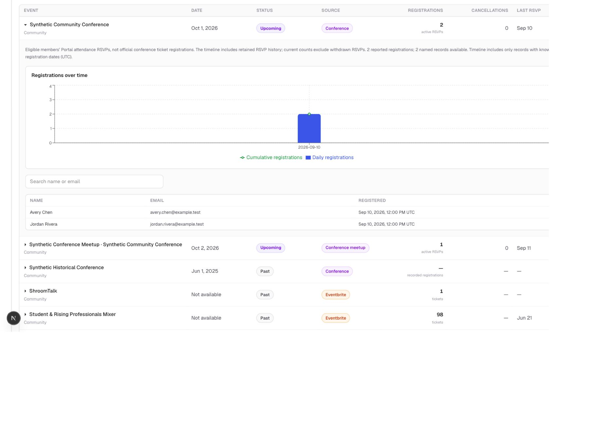
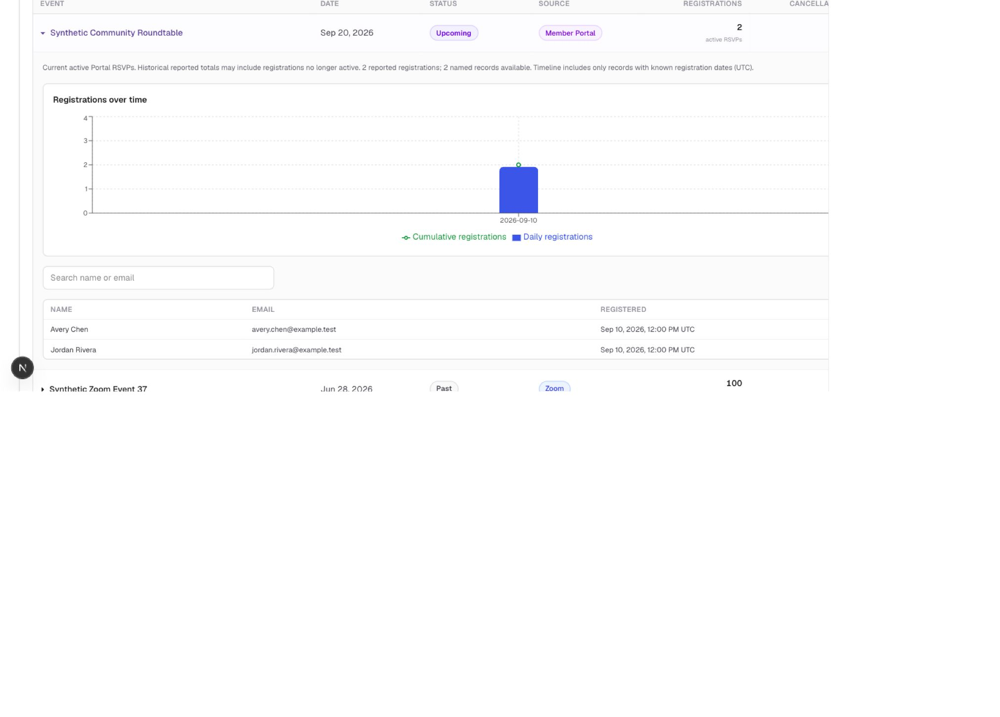
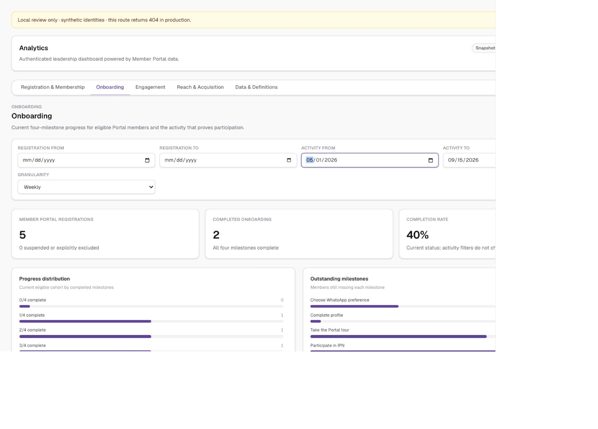
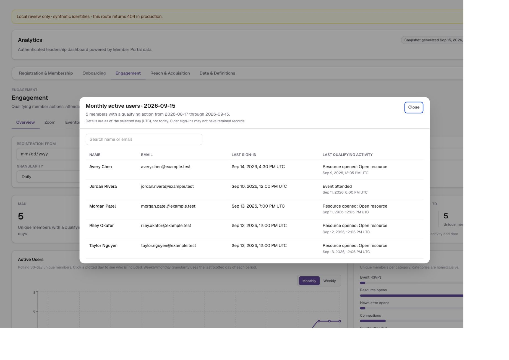
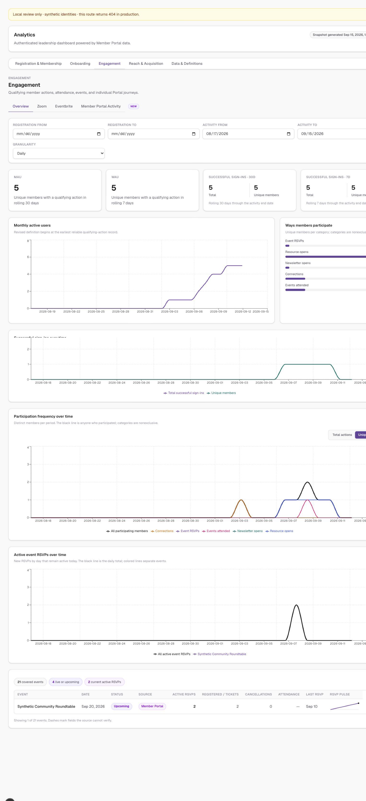
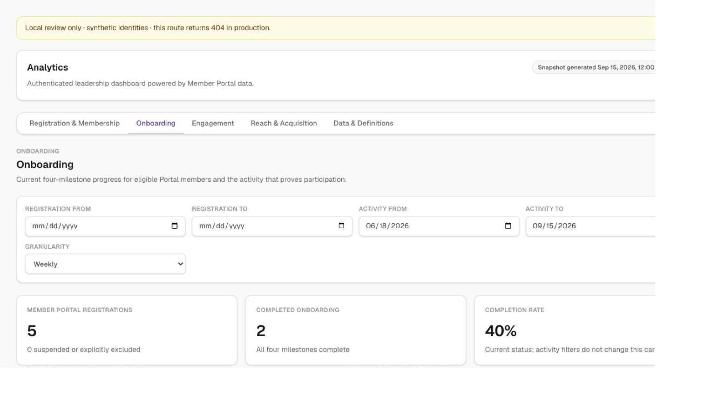
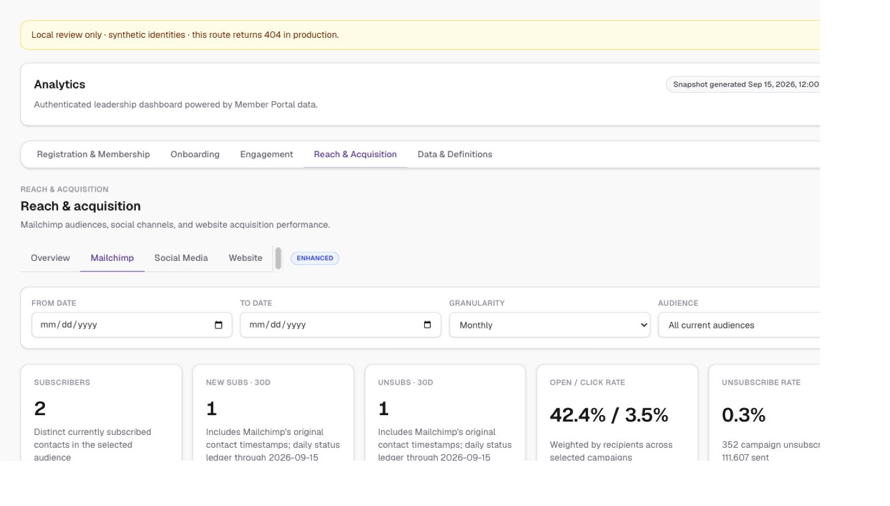

# Analytics dashboard review

## Approved PR #63 integration (2026-09-18)

- Justin approved publishing the completed analytics updates to the existing PR. Merged the branch's registration-barrier commits without conflicts and confirmed latest main was already included; neither main nor production deployment was changed.
- Combined checks: `npm run lint`, `npm test` (165 passed), `npm run build`, and `git diff --check`. Lockfile/dependencies unchanged by integration. Browser recheck confirmed the Community inventory filter and conference/meetup rows still render with no console warnings/errors.
- Detailed analytics workflows and synthetic screenshots below remain the local QA record. Authenticated production Save and account/RSVP mutation tests were not performed.

## Community inventory and complete labeling catalog (2026-09-18)

- Added published/archived conferences, embedded conference meetups, and historical conference-directory entries to the inventory and labeling controls. Draft conferences are omitted. Exact name/date overlap prevents duplicate directory entries; distinct events are not fuzzy-merged.
- Conferences and meetups default to Community. Inventory Event type replaces Source filtering with IPN Labs, PsychedelX, and Community; source remains a visible column. Other is retained for legacy unlabeled records and remains visible under All event types.
- Labeling controls include historical Zoom records, the scheduled Zoom feed, Portal events, conferences, and meetups, even when internal/excluded. Added a searchable catalog and shared in-page saved overrides so inventory and controls use the same labels. Public/Internal remains independent of program and governs inventory inclusion.
- Conference counts represent eligible members' Portal attendance RSVPs, not official conference tickets. Current counts exclude withdrawn RSVPs; timelines include available retained completion history. Historical directory entries with no registration source show unavailable counts/details, not invented zeros. Four community-table reads run concurrently and paginate past the Supabase 1,000-row response limit; failed reads produce an explicit coverage warning.
- Browser QA through the in-app browser on synthetic `/analytics-review` verified all three filters, two conference registrants, one meetup registrant, UTC dates, name search, historical unavailable detail, Community labeling defaults, and an internal scheduled Zoom record remaining editable. Daily/cumulative conference registrations both showed 2. No browser console warnings/errors or framework overlay observed. Authenticated server-action Save was not exercised against production; the synthetic route exposes controls for review but does not bypass server authorization and remains unavailable in production builds.
- Final verification: lockfile dependency installation was completed during this local QA loop; `npm run lint`, `npm test` (161 passed), `npm run build`, and `git diff --check` passed. Existing middleware deprecation, Node test-runner module notices, and dependency advisories remain; no dependencies changed.
- Applied only the additive Community vocabulary expansion to production Supabase through the authorized connector. Local migration: `supabase/migrations/20260918164335_analytics_community_event_labels.sql`. Remote migration versions may differ; inspect history before replaying. Verified the expanded check constraint, RLS still enabled, and no anon/authenticated table grants. No account, RSVP, or saved label rows were changed. UI changes were approved for publishing to PR #63 after local QA.
- Supabase advisors also reported existing trigger-function execute-permission warnings ([anonymous](https://supabase.com/docs/guides/database/database-linter?lint=0028_anon_security_definer_function_executable), [authenticated](https://supabase.com/docs/guides/database/database-linter?lint=0029_authenticated_security_definer_function_executable)) and disabled [leaked-password protection](https://supabase.com/docs/guides/auth/password-security#password-strength-and-leaked-password-protection). These protections were not modified by this change and need a separate security review.

## First participation and public event inventory (2026-09-18, local only)

- Onboarding attribution is exclusive: one eligible member, one first qualifying completion category. The first completion is selected across retained history before applying activity dates; later actions and cancellations do not reattribute it. This marks the participation milestone, not necessarily all four onboarding milestones.
- An earlier retained milestone timestamp without ledger source detail is labeled Earlier completion · source unavailable rather than guessed from later activity.
- Inventory includes only public, included Zoom events, honoring existing classification overrides. Internal meetings are excluded from both historical and upcoming rows.
- One Registrations column replaces Active RSVPs and Registered/tickets: active registrations for live/upcoming events, recorded totals for past events. Overlapping source totals are not added together. Source remains visible.
- Removed inventory attendance and RSVP pulse. Event title buttons expand daily blue registration bars, a green cumulative line, and a searchable Name / Email / Registered table with UTC timestamps and 25-row pagination. The existing Zoom attendance-detail tab is unchanged.
- Portal/Zoom named rows are deduplicated by normalized email, with Portal detail preferred. Eventbrite supplies ticket totals/daily sales but no named registrant export; missing detail and unknown timestamps are explicitly labeled, and attendee records are not substituted.
- Browser QA on synthetic `/analytics-review` confirmed event expansion/collapse, daily/cumulative values (2/2), two registrants, name search, Eventbrite timeline and missing-name notice, and first-participation date filtering (two attributed members across history, zero after their first completion dates). No browser console warnings/errors or framework overlay observed.
- Regression tests cover public inclusion overrides, overlapping emails, UTC daily/cumulative trends, non-additive counts, exclusive first action, cancellation, excluded accounts, historical-source gaps, and filtering after first-action selection. No production data changes or migrations.
- Final verification: `npm ci`, `npm run lint`, `npm test` (157 passed), `npm run build`, and `git diff --check` passed. No dataless files found. Existing dependency advisories and middleware deprecation remain; no dependencies were changed.

## Active Users drill-down update (2026-09-18, local only)

- Renamed the Engagement overview chart to Active Users; Monthly (rolling 30 days) is the default, with a Weekly (rolling 7 days) toggle retained in the URL.
- Chart points support mouse click and Enter/Space. A plotted-day selector and View members button provide another accessible entry point.
- Searchable member dialog includes name/email, last successful sign-in, and last qualifying action with UTC timestamps as of the selected day. The redundant Last activity column was removed after local review. Future activity is excluded; missing history is labeled No retained record.
- List inclusion and plotted counts share the same rolling-window helper and registration cohort. Weekly/monthly chart granularity represents the last plotted day in each bucket, not summed rolling user counts.
- Added boundary, cohort, unique-count, historical-as-of, nonqualifying-sign-in, and empty-window regression tests. All 152 tests passed; lint and production build passed.
- Local browser QA confirmed the default monthly mode, monthly chart-point click (five plotted users → five table members), searchable names, Escape close, weekly toggle and keyboard point selection, date-selector fallback, zero-member empty state, and weekly display granularity. Four-column layout confirmed after review. Browser console warnings/errors: none. Focus-restoration code is included, but SVG focus restoration could not be confirmed in the background browser tab.
- No production data changes, migrations, or new dependencies. Existing audit caveats below remain.

## Scope

Consolidates the leadership dashboard into Registration & Membership, Onboarding, Engagement, Reach & Acquisition, and Data & Definitions. Adds eligibility/deletion safeguards, resumable onboarding and participation attribution, total/unique sign-in and participation charts, daily event RSVP series, searchable event inventory, and Mailchimp contact/status ingestion.

## Local verification (2026-09-17)

- Clean local worktree; no macOS dataless files.
- Synced latest main (`f41a64d`) before verification.
- `npm ci` completed from the lockfile.
- `npm test`: 150 tests passed.
- `npm run lint`: passed.
- `npm run build`: passed; existing middleware-to-proxy deprecation warning remains.
- `git diff --check`: passed.
- Browser checked synthetic `/analytics-review` Registration & Membership, Onboarding, Engagement overview, Reach/Mailchimp, and Data & Definitions.
- Verified participation total/unique toggle, sign-in series, daily event RSVP series, and event inventory search (21 events reduced to one matching event).
- Browser console warnings/errors: none during these checks.

Screenshots use synthetic identities, not production member data:

## Deploy Preview testing

Use `/dashboard/admin?report=engagement&view=overview`, signing in with an existing admin account. `/analytics-review` intentionally returns 404 in production builds.

Netlify Deploy Preview function variables were verified as configured for the Supabase URL, anon key, service-role key, and Mailchimp API key. Secret values were not printed or committed. The service-role key is consumed server-side after admin authorization.

The preview shares production Supabase data and inherited integration credentials. Account creation, profile edits, RSVPs, connections, suspensions, and deletions can change production data and may trigger real notifications. This QA did not create accounts or mutate production data.

Email-based signup/reset callbacks may require the preview URL in the Supabase Auth redirect allowlist. No Auth configuration changes were made here.

## Migration and ingestion caveats

The eligibility/participation and Mailchimp ledger migrations were already applied to the production project through its authorized connection during earlier local implementation. Local SQL filenames and remote migration versions differ; inspect remote migration history before applying them again. Do not reset production.

The Mailchimp tables still require a first successful contact sync. Creating a PR does not run the daily source-refresh ingestion job; that workflow uses the code on main unless explicitly run against this branch. The preview can therefore show unavailable 30-day cards until ingestion runs.

Initial status history is a backfill, not a complete event log. Mailchimp `last_changed` can reflect changes other than an unsubscribe, and daily snapshot polling can miss multiple transitions between pulls. The current implementation must not be treated as independently verified, complete 30-day subscribe/unsubscribe history. Event webhooks plus reconciliation and a clearly stated reliable coverage start are follow-up work for fully trustworthy historical counts.

Current-active RSVP series describes currently active registrations grouped by registration date, not an immutable record of every RSVP ever submitted. Unknown historical active counts are shown as unavailable rather than zero.

## Existing dependency audit risk

`npm audit` reports 9 advisories (1 critical, 6 high, 1 moderate, 1 low) in the existing dependency tree. Dependencies were not changed in this work. Next.js 16.2.6 and its image stack need a separate security update/reverification before production release; see [Next.js middleware bypass advisory](https://github.com/advisories/GHSA-6gpp-xcg3-4w24) and [image processing advisory](https://github.com/advisories/GHSA-2xp9-vwfh-vxw4).

This PR is for review and preview testing, not authorization to merge or deploy production.
