# IPN leadership workflows — local review

Branch: `feature/leadership-workflows`. Production routes: `/dashboard/admin/media` and `/dashboard/admin/expenses`. Admin navigation also links to Analytics, Content and Leadership.

The implementation is local and integrations default to **off**. The production database migration has not been applied. No branch has been pushed, PR opened, production release made or live notification sent. Schema, auth and shared navigation touch Luke's ownership areas and need his review before merge.

## Media intake and SOP

Retained from the [original Canva SOP](https://www.canva.com/design/DAGbUiV46dw/-mNispYBjORjmihqzo_IYw/edit): idea name, requester/date, team/project, brief, platforms, formats, headline/body/caption, supporting material, deadline, acceptance and producer.

Added or clarified: event/announcement/campaign/educational request types; event/meetup prefill; “Media to advise”; copywriting help; urgent flag; a single required **When does this need to be posted by?** date; needs-information notes; one Media owner for production through publication; a monthly calendar of deadlines, scheduled posts and actual posting dates; final asset links; review history; published links and actual posting dates. The image generator is outside this scope. The original uncommitted media pilot remains untouched in the brand-guidelines project.

1. Leadership submits a brief in Admin → Media Requests. A submission notifies private `#media-space` and tags Agnes (`U0C5PPBBEK1`, verified against the Director of Media announcement).
2. Agnes requests missing information or accepts it, then assigns the Media owner.
3. The team tracks Assigned → In production → Director review → Ready to post → Posted. Each request tracks one piece of content, with one Media owner and direct fields for a scheduled date, final Drive/Canva asset link, published link and actual posting date. There is no add/remove content item or second content status. Submit separate requests when outputs need separate tracking; intake still supports multiple formats and platforms.
4. After final review, saving the published link and actual date together marks the request Posted. Posted records retain their final record. Changing a reviewed final asset requires review again. Publication cannot bypass Director review. Media activity/comments collapse by default; expense history remains open.

The media queue uses a list with Idea Name, Request Type, Submitter, Submitted date, Status, Media Owner and Publish by date. The last column is the requested posting deadline. Default sorting is earliest deadline first; all columns support sorting through headers or the Sort by selector, with an ascending/descending toggle. Text search includes title, type, submitter, status, owner, deadline, team and brief. Status filtering, urgent indicators, row opening and keyboard access remain available; sorting survives opening a detail and returning to the queue. The list scrolls horizontally on mobile.

All eligible leadership can view and edit the queue. Agnes's ownership is an operating convention; separate media editing permissions are deliberately deferred. Urgent does not bypass review. Platforms and formats may be left for Media to advise. Formats use a multi-select dropdown, including Email Campaign; requested platforms include Email. Submission requires selecting copywriting help or providing at least one of headline, body or caption. Field helpers explain the brief, deadlines, copy and ownership. The Media calendar uses portal request deadlines and publication records, with search/status filters, month navigation and a mobile agenda. Cancelled requests are excluded; it does not connect to an external calendar. Acceptance means the brief is usable for production; Ready to post records final review separately.

The optional **Link to include** intake section sits above Draft copy and captures one audience destination URL plus required placement instructions (for example, Instagram bio or email button). It is separate from Drive/Canva source assets, appears prominently near the top of the request detail, and is included in the Slack media notification template. Posting a request with a destination requires the Media owner to check that the link was included in its specified location. The server records the confirming person/date; editing the URL or placement clears confirmation and returns accepted work for review. This is manual confirmation, not automatic verification of the live platform. Existing requests without a destination retain their normal posting flow.

## Expense process

Cost inputs show a $45.00 example and accept digits with up to two decimal places, without currency symbols. Expense discussion takes place in Slack; the portal retains automatic activity history and approval/rejection notes.

The approver dashboard combines Relay and Reconsider balances in one Total IPN funds card, with separate amounts, evidence dates and Reconsider estimate labeling. Approved unpaid commitments remain separate and are not deducted from recorded funds.

Only preapproval intake is supported: automatic submitter plus Expense, Purpose, Cost (USD), and optional item/expense link. Justin alone approves or rejects, including his own submissions; Justin is the default IPN-card purchaser. Leadership sees its own expenses; Justin sees all.

Both expense tabs use a list with Expense, Purpose, Submitter, Submitted date, Cost and Status columns. Rows open the existing detail view, including keyboard access through the expense title. Cost shows the requested amount until purchase, then the actual amount. Long purposes are limited to two lines in the list; full text remains in the detail. Search/status filters apply to the list, and horizontal scrolling keeps every column available on mobile.

Pending/rejected/cancelled submissions are in **Requests**. Approved commitments and completed expenses are in **Approved expenses**. Approval does not change actual cash. An expected spending month can be set during approval or later; undated commitments are counted and flagged separately from monthly forecasting.

After approval, record the actual purchase amount/date. IPN card payments record the paying account and enter Transactions once. A preapproved personal payment stays Awaiting reimbursement until Justin records the IPN reimbursement date/account. Receipts are linked after purchase and may be added later. No receipt or media file is uploaded to Supabase. Material edits require approval again; actual spending above the approved cap is rejected. Unpaid requests can be cancelled. Existing historic reimbursements remain in the finance model rather than creating retrospective approval requests.

Slack channel notifications have Approve, Reject and Open in Portal actions. Approval uses a signed callback, Justin's verified Slack ID (`U061Z7YC3DX`) and the current revision. Rejection collects a reason in a modal. Status changes notify submitters by Slack DM, with portal-email lookup or explicit profile-to-Slack mapping; failed delivery remains queued. No expense emails are sent.

The initial notification shows dated recorded Relay cash, cash after the proposed purchase, cash after other approved commitments, and separate estimated Reconsider holdings. The projection conservatively assumes unpaid commitments come from Relay; it is not a live bank balance.

Bank CSV import and matching are deferred from the initial portal UI. The existing secured backend remains available for a later reconciliation workflow: it matches imported bank metadata to recorded payments, rather than pulling expenses from Sheets. Matching checks account/amount and cannot append another expense; the database enforces one request per matched bank transaction. Current operations are approval → purchase → receipt, followed by bank/ledger checks in the finance tracker.

## Finance tracker cleanup — completed October 5

[Original tracker](https://docs.google.com/spreadsheets/d/1hG9oRgo19vH9HH54kYIWDy8YeJaQdUtNJdJAARpfnmE/edit) · [Backup before cleanup](https://docs.google.com/spreadsheets/d/12aL_XfESae--VU_s9Q8f0o4D0APij9PVLrN_U7Y22hQ/edit)

- Dashboard: dated balances, recurring cost, confirmed runway, confirmed/expected cash chart, receivables and unresolved evidence.
- Accounts: Relay versus sponsor-held funds; immutable evidence checkpoints; subsequent actual ledger activity; sponsorship receivable linked to Forecast Inputs.
- Transactions: original A:I records preserved; J:L adds Request ID, Receipt Link and Bank Transaction ID. Actual IPN payments only.
- Expense Requests: native table with approval, scheduling, purchase, reimbursement, receipt and portal metadata. Empty until live integration is configured; edit requests in the portal.
- Recurring Expenses: original vendor amounts and start/end dates retained.
- Forecast Inputs: Pending/Confirmed replaces scenario tiers; settlement status remains separate. Paid/cancelled rows are excluded. Portal-linked copies are excluded to avoid counting a request twice.
- Forecast Model: eight visible columns; actuals plus remaining recurring costs and dated commitments; confirmed versus including pending cash. Hidden I:K supports the dashboard chart only.
- Checks/Sources: reconciliations, missing receipt/date flags, duplicate payments and documented assumptions.

Balance evidence dates have been retained; cleanup does not refresh bank evidence. Sponsor-held cash and Mailchimp billing remain provisional. The existing amount owed to Justin is treated as a confirmed obligation, with itemization still needed. The sponsorship pledge and possible July 2027 costs remain pending. Checked cash roll-up, forecast anchor, known obligation timing and December endpoints against independent calculations.

Only actual movements after a checkpoint date change its account balance, so already-included historic transactions are not subtracted twice. Checkpoints represent end-of-day evidence. When updating a checkpoint later, reconcile the forecast anchor as well; the current forecast deliberately retains the September 29 anchor. Manual forecast items must be marked Paid when their payment enters Transactions. Internal transfers require both account sides so combined holdings stay correct. The forecast is bounded through December 2028 and live sync through row 1000; expand deliberately when needed.

## Production setup after local approval

1. Review/apply `supabase/migrations/20261005173140_leadership_requests.sql` to the existing Member Portal project `plgzakxecjlzepzeqiio`. It stores metadata, history, queued deliveries and imported bank metadata; no storage bucket. Verify sole approver profile `a8be2531-9c64-4cd6-b1cd-1a12f8465609`. Reads use RLS; writes use verified server actions with revision checks.
2. Create/install the Slack app using `config/slack/leadership-workflows-app.json`. Create restricted `#expense-submissions`, invite its bot and Justin, and invite the bot to private `#media-space` (`C088ZJBM0QY`). Ensure Agnes has an eligible portal profile assigned to the Media team through the existing Leadership tab; her Slack identity does not create a portal account. Interactivity URL: `https://members.intercollegiatepsychedelics.net/api/slack/expenses`. Set bot token, signing secret, workspace ID and expense channel ID as server-only environment values. Do not reuse the feedback webhook as an interactive bot credential.
3. Create a Google service account with Sheets API access and share only the finance tracker with its email as editor. Set its email/private key in server-only environment variables. Connected app credentials are not available to the deployed portal.
4. Keep `WORKFLOW_INTEGRATION_MODE=off` in deploy previews. Set it to `live` only for the configured production environment, after reviewing a controlled first submission. Explicit Slack mappings live in `leadership_workflow_settings.slack_user_ids` if portal/Slack emails differ.
5. Durable outbox retries via the scheduled Netlify function. Justin can retry pending integrations in the portal. Sheets row allocation is protected by a shared database lease across workers; sync uses current request state and stable Request IDs. Failed external delivery never rolls back a saved request.

## Local verification

`npm ci`, `npm run qa:install`, `npm run lint`, `npm run build`, `node --test --experimental-strip-types tests/leadership-workflows.test.mjs`, `npm run qa:local`.

The local preview binds only to localhost, requires the explicit development flag, and is unavailable in production. Start with `npm run workflow:dev`, then visit `http://127.0.0.1:4327/workflow-preview/media` or `/workflow-preview/expenses`. It uses sample people and writes only ignored local JSON. No sign-in is needed: use “Preview as” to switch roles. Preview navigation stays within these two workflows; other Admin tabs are disabled because real authentication is intentionally disconnected. Runtime Slack/Sheets deliveries are disabled. The preview uses a bounded viewport with its own content scroll pane and a full-height desktop sidebar; mobile keeps the workflow links without the desktop sidebar. Empty detail sections are omitted to reduce spacing.

Browser QA covers submit/approve/purchase/receipt, expense privacy and preapproved reimbursement, complete media production/review/publication with a single owner, multi-format and Email selection, required copy choice, decimal-only costs, media calendar dates and leap months, mobile event prefill/calendar, authentication redirects, CSRF, unauthorized approval, stale revisions and invalid Slack signatures. Database tests apply the actual migration in PGlite and check RLS, server-only mutation access, audit/outbox atomicity and the shared sheet lease. Live Slack delivery and deployed service-account sync remain untested until credentials are configured.

Full repository suite: 179/180 passed. The unchanged Instagram archive test fixture uses account `123` against the current snapshot's different account and fails with “Instagram snapshot account mismatch”; unrelated to these workflows. The production build's existing middleware deprecation warning remains.

## Review screenshots

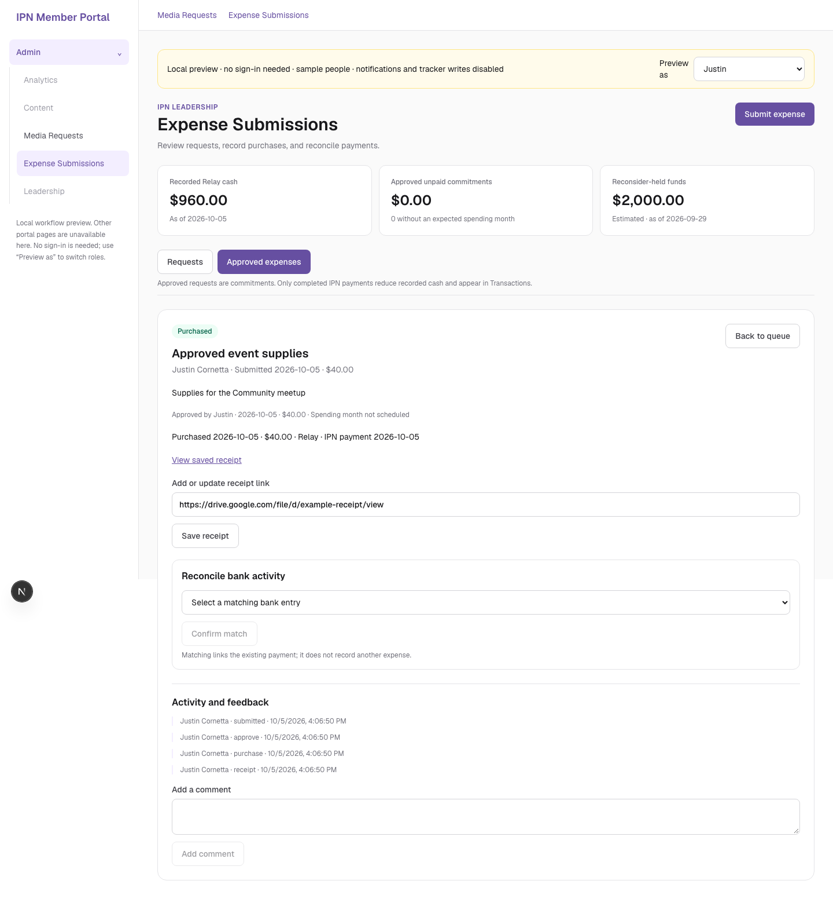

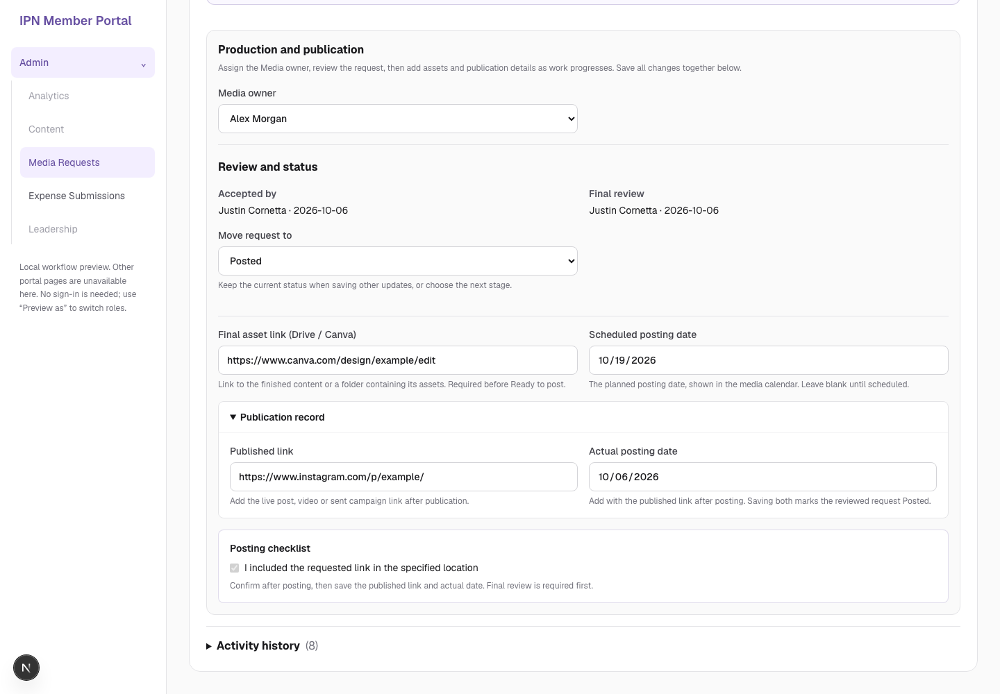

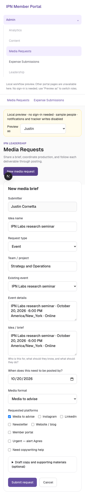

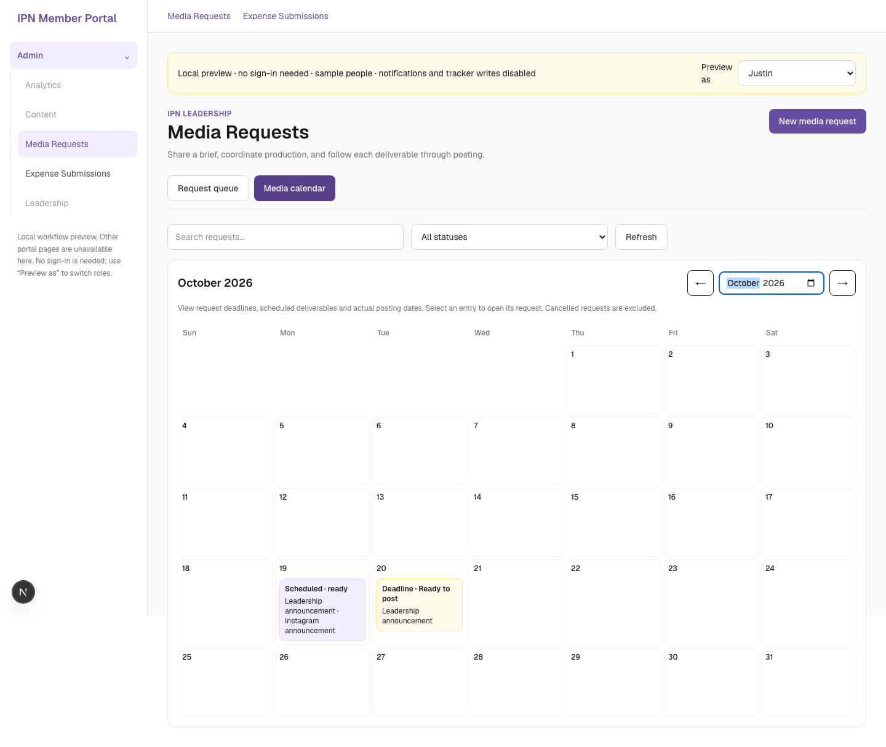

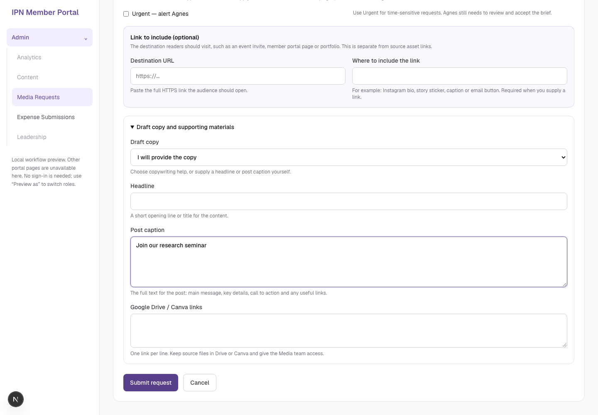

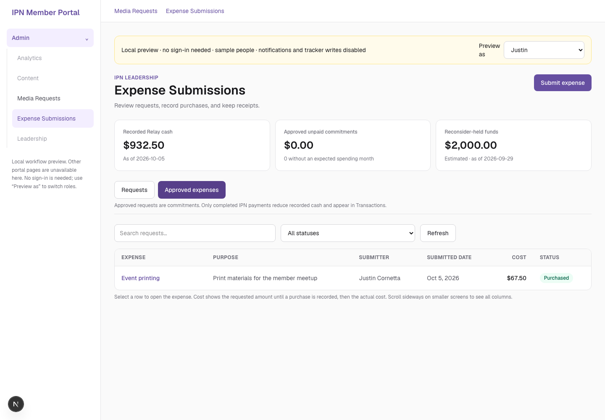

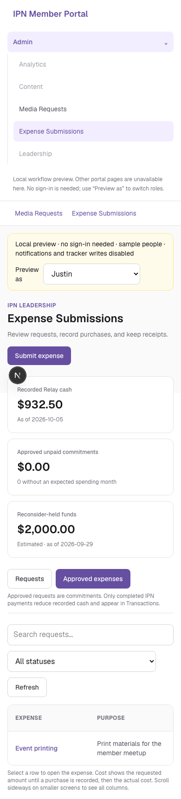

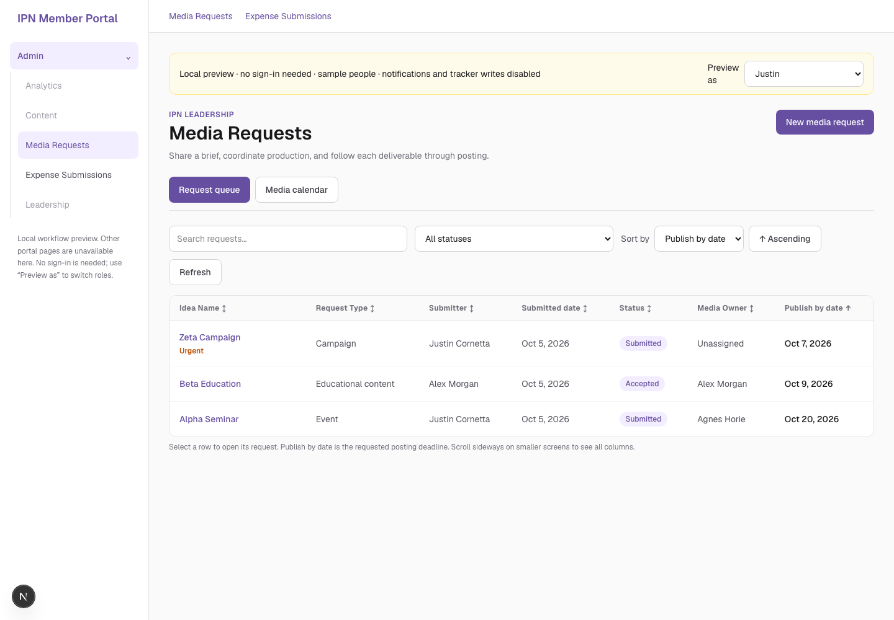

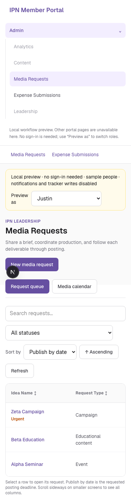

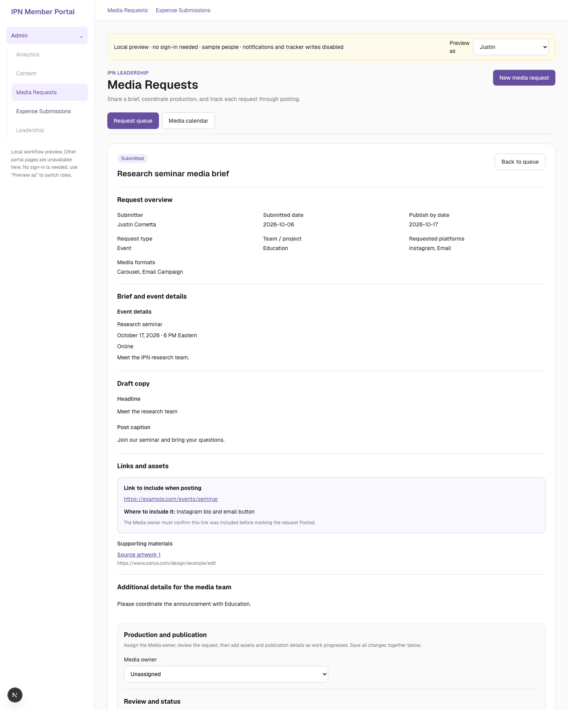

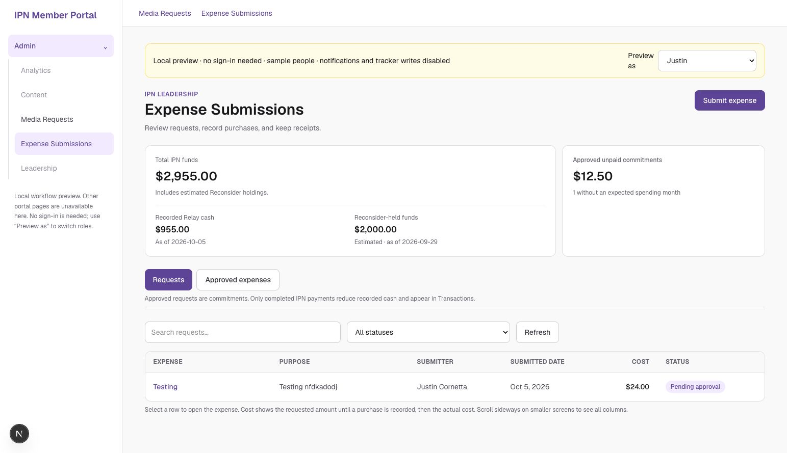

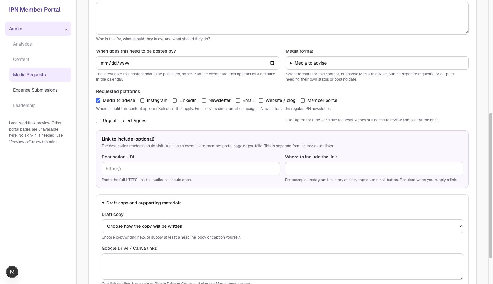
